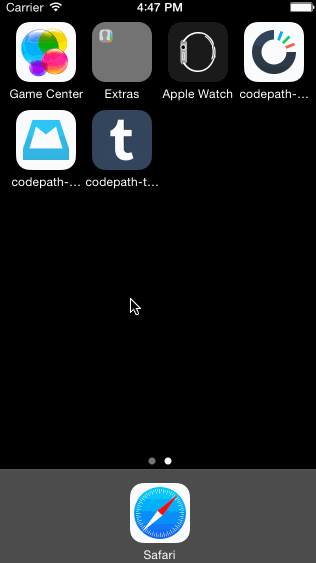

# Codepath Week 4: Tumblr

### Description:
This is a fake Tumblr iOS application that simulates the logged out Tumblr experience in addition to an animated compose experience.

### Time spent:
7.5 hours spent in total

### Completed user stories:
 * [x] Tapping on Home, Search, Account, or Trending should show the respective screen and highlight the tab bar button.
 * [x] Compose button should modally present the compose screen.
 * [ ] Optional: Compose screen is faded in while the buttons animate in.
 * [x] Optional: Login button should show animate the login form over the view controller.
 * [x] Optional: Discover bubble should bob up and down unless the SearchViewController is tapped.
 
### Notes:
The touch-target for my 'Nevermind' button conflicted with the underlying tab-bar. 

### Walkthrough of all user stories:

GIF created with [LiceCap](http://www.cockos.com/licecap/).